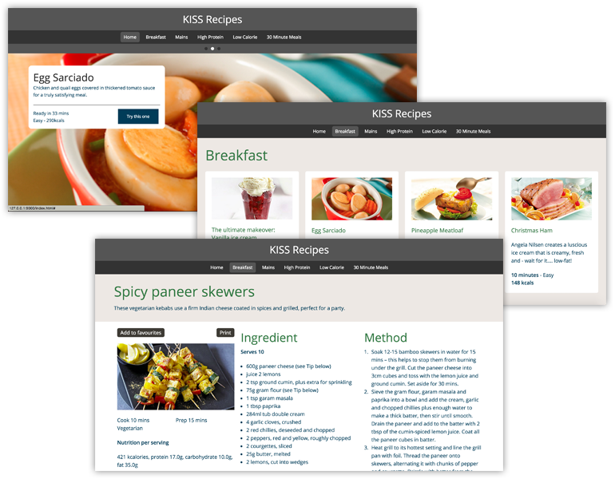

# Django Workshop at PyConPH 2015

**by Jon Danao**

Django is a batteries-included Python web framework for creating dynamic web applications and APIs. It is free and open source, has extensive documentation and a large community. In this workshop you will learn how to setup your project, interact with the database and render front-end HTMLs.

* **Expected length:** 3 hours
* **Talk level:** Beginner and Intermediate
* **Equipment:** You may bring a laptop for the workshop.

**Jon** is the Head Honcho of [The App Factory](http://theappfactory.io/), previously the Head of Technology for Innovations at ABS-CBN. He played lead guitars for a local band in Manila called Bridge. He is strong in blues, rock and roll, and showmanship. Terrible in second voice. He loves to cook and went to culinary school. He is strong in Asian cuisine and any food with patis (fish sauce) and chili.

> **_This workshop has been tested on OSX Yosemite and Windows 7 64-bit_**

## Topics

### 1. Setup: How to setup your machine for Django

1. Setup for OSX
2. Setup for Linux
3. Setup for Windows

### 2. Project: How to start your Django project

1. Setting up the Development Environment
2. Creating the Django Project
3. Configuring the Site

### 3. Models: How to define your data

1. Creating the Recipe App and its Model
2. Activating the Models in Admin Site

### 4. URLs and Views: How to access your data

1. Naming the URL for Index Page
2. Querying Data for Index Page

### 5. Templates: How to render your data

1. Rendering the Index Page
2. Rendering the Category and Recipe Pages

## Thank You

* Python PH - https://www.facebook.com/groups/pythonph/
* Jay Gauten - jay**@**theappfactory.io
* Randell Quitain - randell**@**theappfactory.io
* Creative Dash for the yummy icons - https://twitter.com/creativedash